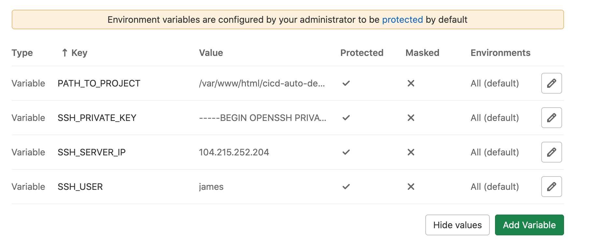

# Gitlab CI/CD

## Deploy với server bình thường (compute instance, droplet, virtual machine, ....)

Overview

- Setup project source code với Dockerfile, compose cho từng environment(production/staging/development) một cách hiệu quả.
- Setup manual đầu tiên trên server.
- Setup pipeplines với các stage build, test, release, deploy. Trong quá trình này mình sẽ có thể connect tới server để lấy dữ liệu `.env` và lệnh script deploy server.

Details

- Để có thể sử dụng ta phải push lên `registry container` của `gitlab`. Vì vậy ta phải login vào.

  - Trên server -> `docker login registry.gitlab.com`.
  - Trên pipelines -> thiết lập `before_script`
    ```
    before_script:
        - docker version
        - docker login -u $CI_REGISTRY_USER -p $CI_REGISTRY_PASSWORD $CI_REGISTRY
    ```

- Trên server setup bước đầu cần 2 yếu tố quyết định để có thể tự động hóa được.

  - Sử dụng ssh-keygen của server để tạo cặp keypair gitlab và copy-paste public key lên trên profile->preference->ssh-key để có thể pull source code về mà không bị authen denied.
  - Tạo ra một bộ key pair, phần public key sẽ fill vào trong file `authorized_keys` của server và phần private key sẽ để ở setting->CICD->variable của gitlab.

- Phần khai báo trong pipelines

  ```
  # do not use "latest" here, if you want this to work in the future
  image: docker:19

  services:
    - docker:dind

  stages:
    - build
    - test
    - release
    - deploy

  before_script:
    - docker version
    - docker login -u $CI_REGISTRY_USER -p $CI_REGISTRY_PASSWORD $CI_REGISTRY
  ```

  > Chúng ta sẽ sử dụng môi trường docker 19 để chạy thực hiện toàn bộ quá trình của pipelines. Đặt biệt vì mình có dùng bộ câu lệnh của docker nên phải đính kèm service docker:dind để có thể tương tác với docker daemond bên trong docker.

- job build in stage build

  ```
  build:
    stage: build
    script:
      - docker pull $CI_REGISTRY_IMAGE:latest || true
      - docker build --cache-from $CI_REGISTRY_IMAGE:latest --tag $CI_REGISTRY_IMAGE:$CI_COMMIT_SHA .
      - docker push $CI_REGISTRY_IMAGE:$CI_COMMIT_SHA
    only:
      changes:
        - Dockerfile
  ```

  > Đầu tiên ta pull image tag là latest về, ta để true ý bảo nếu không tìm thấy thì không sao, cứ chạy tiếp.

  > Lí do ta pull về trước là để ta có thể cache khi build image, để có thể tiết kiệm thời gian build Docker image,

  > Tiếp theo ta tiến hành build image với command docker build.... Ta dùng --cache-from để cache image như ta vừa nói ở trên. Và khi image được build xong ta tag nó để được 2 image với 2 tên khác nhau, 1 tên là latest, tên kia là giá trị của commit hash tương ứng của lần commit code này

  > Cuối cùng là ta push 2 image ta vừa tag lên Registry

- Job deploy

  ```
  deploy:
  stage: deploy
  variables:
    GIT_STRATEGY: none
  only:
    - master
  before_script:
    - apk update && apk add openssh-client bash
  script:
    # chạy ssh-agent tương ứng với Gitlab Runner hiện tại
    - eval $(ssh-agent -s)

    # thêm nội dung của biến SSH_PRIVATE_KEY vào agent store
    - bash -c 'ssh-add <(echo "$SSH_PRIVATE_KEY")'

    # tạo folder ~/.ssh
    - mkdir -p ~/.ssh

    # Scan lấy SSH Host key cho địa chỉ IP server
    # Được kết quả bao nhiêu thì thêm vào file known_hosts
    - ssh-keyscan -H $SSH_SERVER_IP >> ~/.ssh/known_hosts

    # Sửa lại quyền của file known_hosts
    - chmod 644 ~/.ssh/known_hosts

    # Thực hiện SSH vào server, login vào Registry, chuyển tới folder project
    # Down project, pull image về, up project và xoá đi image cũ
    - >
      ssh $SSH_USER@$SSH_SERVER_IP
      "docker login -u ${CI_REGISTRY_USER} -p ${CI_REGISTRY_PASSWORD} ${CI_REGISTRY};
      cd ${PATH_TO_PROJECT};
      docker-compose down;
      docker pull ${CI_REGISTRY_IMAGE}:latest;
      docker-compose up -d;
      docker image prune -f;"
  ```

  > Tiếp theo ta khai báo 1 biến môi trường là GIT_STRATEGY: none, ý bảo là "Gitlab Runner ơi, chú không cần phải tốn thời gian clone code về làm gì đâu, vì giờ anh chỉ chơi với Docker image thôi". Vì mặc định nếu ta không nói gì thì ban đầu Gitlab Runner sẽ clone code về và setup 1 số thứ liên quan tới Git.

  > Tiếp theo ở before_script ta cài openssh-client và bash để thực hiện các command liên quan.

  > Giải thích ở dòng ssh-keyscan ..., khi SSH vào server ta sẽ bị hỏi là có muốn thêm server này vào danh sách những host được biết tới (known_hosts). Nhưng vì Gitlab Runner là máy không phải người nên sẽ không biết mà nhập yes, và dẫn tới Pipeline bị treo và Failed. Do vậy ta cần phải thêm sẵn thông tin server vào known_hosts để không bị hỏi khi ssh.

- Cái đặt các biến môi trường mới cho phù hợp với từng dự án.

  - `Settings` -> `CICD`, ở rộng phần `Variables`

    - PATH_TO_PROJECT: đường dẫn tới project ở trên server
    - SSH_PRIVATE_KEY: Private Key mà ta vừa tạo ở trên
    - SSH_SERVER_IP: địa chỉ IP của server
    - SSH_USER: tên user dùng để truy cập server

  

- Push code lên github thôi.
