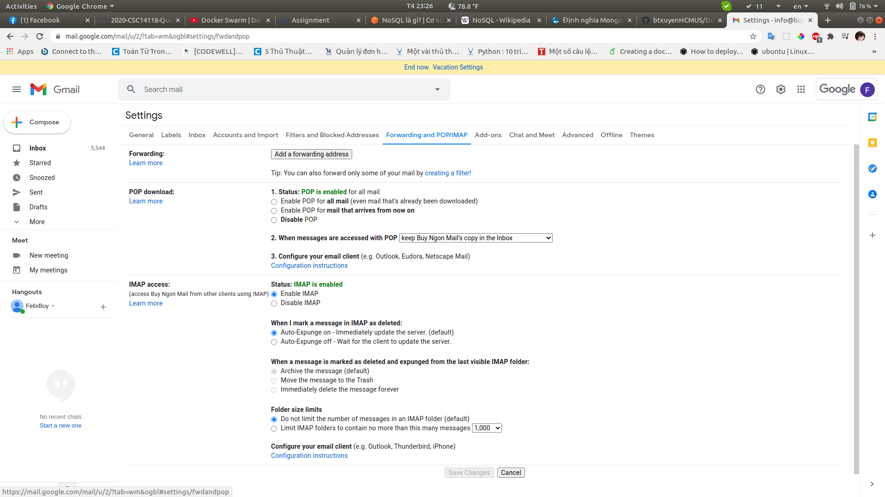

# Trong bài viết lần này sẽ hướng dẫn bạn cài đặt IMAP mail với tài khoản có kích hoạt GSUITE

1. Đầu tiên bạn phải có một tài khoản admin có kích hoạt G-Suite
2. Tạo ra một user, kích hoạt tính năng Xác thực 2 bước cho user tự quyết định.
3. Vào Gmail của user đó, cài đặt như hình bên dưới.
   
4. Vào cài đặt account kích hoạt xác thực 2 bước, mục security, enable 2-step vertify, nó sẽ hiện ra dòng bên dưới App password, vào đó tạo password mới là ta có thể sử dụng gsmtp với username là mail, password là app password mới được generate ra, với port là `587`
