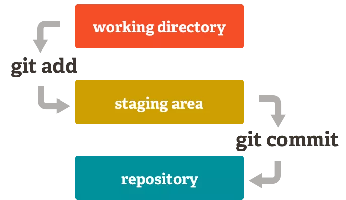
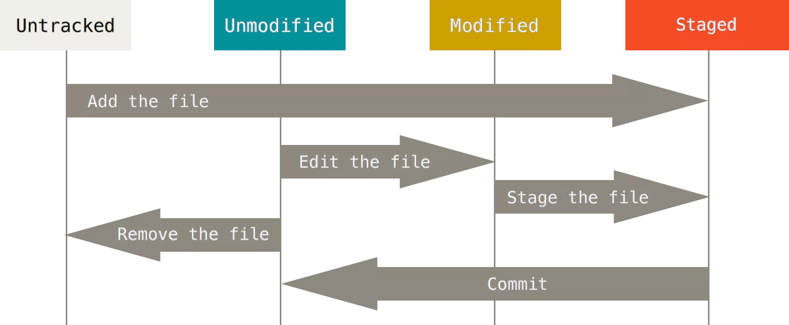

# Git Toàn Tập
## Thiết lập chứng thực cá nhân
Khai báo tên và địa chỉ email trong file cấu hình của git
```
$ git config --global user.name "btxuyenhcmus"
$ git config --global user.email "btxuyenhcmus@gmail.com"
```
Sau khi thiết lập xong, có thể kiểm tra thông tin chứng thực
```
$ cat ~/.gitconfig
```
## Repository
Repository (kho chứa) nghĩa là nơi mà bạn sẽ lưu trữ mã nguồn và một người khác có thể sao chép (clone) lại mã nguồn đó nhằm làm việc. Repository có hai loại là Local Repository (Kho chứa trên máy cá nhân) và Remote Repository (Kho chứa trên một máy chủ từ xa).

- **Local repository**.
```
$ git init git_example
Initialized empty Git repository in /home/btxuyen/git_example/.git/
```
- **Remote repository**
Mình sẽ clone cá remote repository từ các server git(gitlab/github/bitbucker)
```
$ git clone https://github.com/btxuyenhcmus/knowledge-note.git
```

## Staging Area
**Staging Area** là một khu vực mà nó sẽ được chuẩn bị cho quá trình commit. Các hệ thống quản lý phiên bản (Version Control System) thì dữ liệu được lưu ở hai nơi(local & remote).

Nhưng với Git thì nó có thêm một lựa chọn nữa đó là có thêm một khu vưc trung gian gọi là **Staging Area**. Nó sẽ lưu trữ những thay đổi của bạn trên tập tin sẽ được commit, vì muốn commit tập tin nào thì tập tin đó phải nằm trong Staging Area. Một tập tin khi nằm trong Staging Area sẽ có trạng thái là **Stagged**.



## Commit
*Commit* là một hành động để Git lưu lại một bản chụp (snapshot) của các sự thay đổi trong thư mục làm việc, và các tập tin và thư mục được thay đổi đã phải nằm trong Staging Area. Mỗi lần commit nó sẽ được lưu lại lịch sử chỉnh sửa của mã nguồn kèm theo tên và địa chỉ email của người commit.

Nếu bạn muốn commit một tập tin nào đó, bạn sẽ cần phải đưa tập tin đó vào trạng thái tracked bằng lệnh `git add tên_file`. Trong git có hai loại trạng thái chính đó là Tracked và Untracked, cụ thể:
- **Tracked** - là tập tin đã được đánh dấu theo dõi trong Git để bạn làm việc với nó. Và trạng thái Tracked nó sẽ có thêm các trạng thái phụ khác là **Unmodified**(chưa chỉnh sửa gì), **Modified**(đã chỉnh sửa) và **Staged**(đã sẵn sàng để commit).
- **Untracked** - là tập tin còn lại mà bạn sẽ không muốn làm việc với nó trong Git.
> Nhưng bạn phải bên biến rằng nếu tập tin đó đã được Tracked nhưng đang rơi vào trạng thái (Modified) thì nó vẫn sẽ không thể commit được mà bạn phải đưa nó về Staged cũng bằng lệnh `git add`.

## Bỏ qua Staging Area để commit
Bạn có thể đưa một tập tin đã được Tracked để commit mà không cần đưa nó vào Staging Area với tham số  `-a` trong lệnh `git commit`. Ví dụ: `git commit -a -m "Skipped Staging Area to commit"`.

## Tìm hiểu thêm về trạng thái


## How to save username and password in git
Run
```
git config --global credential.helper store
```
then
```
git pull
```
After the first time enter username password, it auto save infomation in daemon and you don't need ente usrname password.

## How to use git command line when you had changed password
Run
```
git pull
```
After push commit, it will require new access token and save in global for the last times.

## copy commit from another branch
```
$ git cherry-pick <id_commit>
```

## Init a reponsitory in local
```
$ git init --bare
```
You can copy pwd of folder bare and clone to another folder