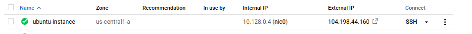
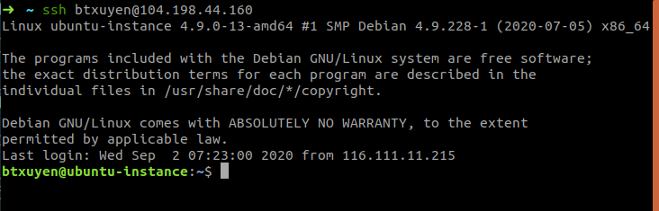
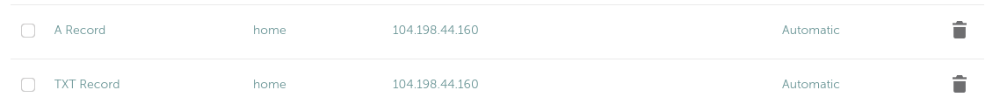

# Bài đọc hôm nay sẽ nói về cách hosting một trang web tĩnh (thuần html/css/js) trên máy ảo (Cloud, DigitalOcean, AWS,..) sử dụng NGINX

> Như các bạn cũng đã biết, để đưa một website có thể hoạt động được trên internet, ta cần phải biết đến 3 thằng cơ bản này đó là hosting, webserver, và domain. Thì hosting ở đây mình sử dụng VMinstance của cloud, các bạn hoàn toàn có thể sử dụng các nhà cung cấp khác, chỉ có nó có Ipv4 public để có thể truy cập từ xa (muốn test được thì các bạn cứ biệt ping ip nhá). Webserver để kết nối từ domain đển hosting, các bạn đừng để bị nhầm lẫn giữa các khái niệm nhá, ở đây mình dùng thằng xịn xò đó là NGINX, các bạn hoàn toàn có thể sử dụng bất kì một webserver nào khách như APACHE2, .... Và domain mình dùng trên namcheap.

# Okey, Let's go

## Step 1. Chuẩn bị một server

Mình đã tạo một instanceVM trên cloud và setup ssh-key để có thể truy cập từ xa.


```
$ ssh btxuyen@104.198.44.160
```



> Mình sẽ làm phần làm sao để có thể register một instance và có thể kết nối thông qua ssh như thể trong bài viết sau.

## Step 2. Chuẩn bị domain

Tạo một domain trên namecheap và cấu hình cho domain đó trỏ về ip máy trên cloud của mình. Ở đây mình dùng subdomain (vì nghèo) `home.codehub.digital` trỏ về ip `104.198.44.160`.


## Step 3. Cài đặt NGINX

Trước khi cài đặt NGINX, vì instance mới được tạo ra nên các package hiện tại đang là version cũ, mình cần update latest package manager.

```
$ sudo apt update && sudo apt upgrade
$ sudo apt install nginx
```

## Step 4. Đưa source code lên server

Mặt định NGINX mong muốn source code của bạn sẽ được đặt trong thư mục đã được chỉ định là `/var/www/`. Bạn có thể sửa nó lại trong config. Nhưng trong bài viết này thì mình không config chuyện đó, mình sẽ để source code vào trong thư mục mặt định.

Tạo thư mục `home.codehub.digital` bên trong thư mục gốc `/var/www/`.

```
scp -r * btxuyen@104.198.44.160:/var/www/home.codehub.digital
```

> scp -r \* là copy toàn bộ nội dung thư mục hiện tại vào thư mục vừa tạo trên instance.

Riêng mình thì dùng git để clone source code từ git về cho nó đúng chuẩn Việt hơn.

```
$ sudo apt install git
$ git clone https://github.com/btxuyenHCMUS/btxuyenhcmus.github.io
```

## Step 5. Configure NGINX to server your website

Bạn cần phải cho NGINX biết về sự tồn ại website của bạn.

`cd` vào `/etc/nginx/`. Đây là nơi NGINX configuration được lưu trữ.

Có hai thư mục chúng ta cần quan tâm là `sites-available` và `sites-enabled`.

- `sites-available` bao gồm các file config cụ thể cho tất cả các website của bạn.
- `sites-enabled` bao gồm các file config liên kết với nginx để nginx thực sự đọc và excute nó.

Tạo file `home.codehub.digital` bên trong thư mục `sites-available` và thêm nội dung sau vào bên trong.

```
server {
    listen 80 default_server;
    listen [::]:80 default_server;

    root /var/www/home.codehub.digital;

    index index.html;

    server_name home.codehub.digital;

    location / {
        try_files $uri $uri/ =404;
    }
}
```

Nội dung bên trong file có nghĩa là:

- Deliver files from the folder `/var/www/home.codehub.digital`.
- The main index pae is called index.html.
- Requests that are requesting `home.codehub.digital` should be served by this `server` block.

Ngay bây giờ khi file đã được tạo, chúng ta sẽ thêm nó vào sites-enables folder để NGINX kích hoạt nó. Cú pháp như sau:

```
$ sudo ln -s /etc/nginx/sites-available/home.codehub.digital /etc/nginx/sites-enabled/home.codehub.digital
```

> Chú ý: các bạn cần viết đúng đường dẫn và trong folder sites-enabled sau khi ls file home.codehub.digital phải màu xanh.
> Ngay bây giờ mình cần phải restart nginx để nó load file mình vừa tạo.

```
$ sudo service nginx restart
```

Nếu bạn gặp rồi ở bước này thì cần xem lại cú pháp của config vừa tạo, hoặc là do đang bị conflict với config default, lúc này mình nghĩ nên xóa file đó đi vì nó không cần thiết nữa.

Và sau khi bạn start được nginx thì mọi thứ hoạt động, bạn đã có thể vào website của mình `http://home.codehub.digital` và chú ý rằng mới chỉ là `http` nếu bạn bị lỗi không vào được web thì hãy check lại là đang `http` hay `https`.

# Enable HTTPS

## Step 1: Acquire an SSL cert

Chúng ta có thể lấy chứng chỉ SSL miễn phí từ **LetsEncrypt**:

```
$ sudo apt-get install software-properties-common
$ sudo add-apt-repository ppa:certbot/certbot
$ sudo apt-get update
$ sudo apt-get install python-certbot-nginx
$ sudo certbot --nginx certonly
```

Sau khi thực hiện các bước trên, certs sẽ được lưu trong thư mục `/etc/letsencrypt/live/home.codehub.digital`;

**Enable auto-renewal for certificates:**
Edit the `crontab` and create a CRON job to run the renewal command (một công cụ schedule action trên linu):

```
$ sudo crontab -e
```

Nếu là lần đầu tiên vào scron nó sẽ yêu cầu chọn trình soạn thảo 1. nano, 2. Vim basic, 3. Vim advan, ...

Paste đoạn code bên dưới vào cuối file:

```
17 7 * * * certbot renew --post-hook "systemctl reload nginx"
```

## Step 2. Tell NGINX to use the SSL cert for your website

Sửa lại file config ban đầu.

Bên trong `server` block chúng ta đã tạo, thay đổi đường dẫn để trỏ về file chứng chỉ chúng ta đã lưu.

```
server {
    # ... Các nội dung lúc trước
    ssl on;
    ssl_certificate /etc/letsencrypt/live/home.codehub.digital/fullchain.pem;
    ssl_certificate_key /etc/letsencrypt/live/home.codehub.digital/privkey.pem;
}
```

Đến bước này các bận cần biết một vấn đề là port chúng ta đang sử dụng. HTTP connections sử dụng port 80 nhưng SSL connections sử dụng port 443. Giải pháp là chuyển từ port 80 thành 443.

```
server {
    listen 443 default_server;
    listen [::]:443 default_server;
    # ... các nội dung cũ...
}
```

Tuy nhiên, vấn đề gặp phải khi người dùng truy cập không phải là `https://`. Để giải quyết vấn đề này, chúng ta sẻ redirect HTTP request thành HTTPS request. Add server block sau bock trước đó.

```
server {
    listen 80 default_server;
    listen [::]:80 default_server;
    server_name home.codehub.digital;
    rewrite ^ https://$host$request_uri? permanent;
}
```

Bây giờ chúng ta cần restart NGINX để nạp các config vừa rồi.

# Improve performance

## Enable HTTP/2

HTTP/2 cho phép trình duyệt request tập tin song song, cải thiện hoàn hảo tốc độ truyền. Bạn sẽ cần kích hoạt HTTPS. Sửa file config nginx và thêm `http2`, sau đó restart NGINX:

```
server {
    listen 443 http2 default_server;
    listen [::]:443 http2 default_server;
    # ... all another content
}
```

## Enable GZIP compression

nén gzip có thể làm giảm đáng kể kích thước của tập tin trong suốt quá trình truyền.

```
server {
    # .. previous content
    gzip on;
    gzip_types application/javascript image/* text/css;
    gunzip on;
}
```

Điều này đảm bảo rằng javascript, images, và css files luôn được nén.

> **Chú ý:**
>
> Một lỗ hổng bảo mật tồn tại khi bạn kích hoạt nén gzip kết hợp với HTTPS cho phép kẻ tấn công giải mã dữ liệu. Đối với các trang web tĩnh không cung cấp dữ liệu nhạy cảm của người dùng, đây là một vấn đề nhỏ, nhưng đối với bất kỳ trang web nào cung cấp thông tin nhạy cảm, bạn nên tắt tính năng nén cho các tài nguyên đó.

## Enable client-side caching

Some files don't ever change, or change rarely, so there's no need to have users re-download the latest version. You can set cache control headers to provide hints to browsers to let them know what files they shouldn't request again.

> Một số tệp không bao giờ thay đổi hoặc hiế khi thay đổi, do đó, người dùng không cần phải tải xuống lại phiên bản mới nhất. Bạn có thể đặt tiêu đề kiểm soát bộ nhớ cache để cung cấp gợi ý cho cá trình duyệt để cho họ biết những tệp nào họ không nên yêu cầu lại.

```
server {
    # ... after the location / block
    location ~* \.(jpg|jpeg|png|gif|ico)$ {
        expires 30d;
    }
    location ~* \.{css|js}$ {
        expires 7d;
    }
}
```

Kiểm tra tần suất các loại tệp khác nhau thay đổi, sau đó đặt chúng hết hạn vào những thời điểm thích hợp.
