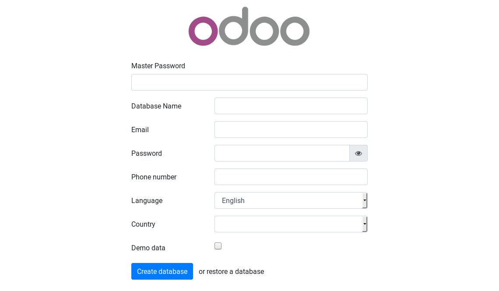

This article is created based on [linuxize.com](https://linuxize.com/post/how-to-deploy-odoo-12-on-ubuntu-18-04/)

# How to deploy Odoo 12 on Ubuntu 18.04

## Before you begin
Login to you ubuntu machine as a **sudo user** and update the system to the latest packages:
```
$ sudo apt update && sudo apt upgrade
```
Install **Git, Pip, Nodejs** and the tools required to build Odoo dependencies:
```
$ sudo apt install git python3-pip build-essential wget python3-dev python3-venv python3-wheel libxslt-dev libzip-dev libldap2-dev libsasl2-dev python3-setuptools node-less
```

## Create Odoo user
Create a new system user for Odoo named odoo12 with home directory `/opt/odoo12` using the following command:
```
$ sudo useradd -m -d /opt/odoo12 -U -r -s /bin/bash odoo12
```
>You can use any name for your Odoo user as long you create a PostgresSQL user with the same name.

## Install and Configure PostgreSQL
Install the **PostgreSQL** package from the Ubuntu's default repositories:
```
$ sudo apt install postgres
```
Start PostgreSQL
```
$ sudo service postgresql start
```
Create a PostgreSQL user with the same name as the previously created system userm, in our case that is odoo12:
```
$ sudo su - postgres -c "createuser -s odoo12"
```

## Install Wkhtmltopdf
The `wkhtmltopdf` packages provides a set of open-source command line tools which can render HTML into PDF and various image formats.
Download the package using the following **wget** command:
```
$ wget https://builds.wkhtmltopdf.org/0.12.1.3/wkhtmltox_0.12.1.3-1~bionic_amd64.deb
```
Once the download is completed install the package by typing and this is saved in the current directory that you input command.
```
$ sudo apt install ./wkhtmltox_0.12.1.3-1~bionic_amd64.deb
```
And I usually delete package file that everything happy.
```
$ sudo rm ./wkhtmltox_0.12.1.3-1~bionic_amd64.deb
```

## Install and Configure Odoo
We will install Odoo from Github repository inside an isolated [Python virtual environment](https://linuxize.com/post/how-to-create-python-virtual-environments-on-ubuntu-18-04/)
Before starting with the installation process, **change to user** "odoo12":
```
$ sudo su - odoo12
```
Starting by cloning the Odoo12 source code from the Odoo Github repository:
```
$ git clone https://www.github.com/odoo/odoo --depth 1 --branch 12.0 /opt/odoo12/odoo
```
Once the source code is downloaded, create a new PYthon virtual environment for the Odoo 12 installation:
```
$ cd /opt/odoo12
$ python3 -m venv odoo-env
```
Next, activate the environment with the following command:
```
$ source odoo-venv/bin/activate
```
Install all required Python modules with pip3:
```
(venv) $ pip3 install wheel
(venv) $ pip3 install -r odoo/requirements.txt
```
Deactivate the environment using the following command:
```
(venv) $ deactivate
```
Create a new directory for the custom addons:
```
$ mkdir /opt/odoo12/odoo-custom-addons
```
Switch back to your sudo user with `exit`
```
$ exit
```
Next, edit configuration file:
```
$ sudo nano /opt/odoo12/odoo/debian/odoo.conf
```
```
[options]
; This is the password that allows database operations:
admin_passwd = admin
db_host = False
db_port = False
db_user = Odoo12
db_password = False
addons_path = /opt/odoo12/odoo/addons,/opt/odoo12/odoo-custom-addons
```
> If you run config admin_passwd, Do not forget to change `admin` to something more secure.

## Test the Installation
```
$ su - odoo12
$ odoo/odoo-bin -c odoo/debian/odoo.conf
```


### You can customize odoo-bin command interface, you can `odoo/odoo-bin --help` to more information paramter. Continue...
- Note 1: if you want vistor not view and action to list db, you can config paramter `list_db=False`

## Configure Nginx as SSL Termination Proxy
Ensure that you have met the following prerequisites before continuing with this section:
    - Domain name pointing to your public server IP. You can create domain name on [namecheap](https://namecheap.com), in this tutorial we will use `example.com`.
    - [Nginx Installed](#).
    - SSL certificate for your domain.
The default Odoo web server is serving traffic over HTTP. To make our Odoo deployment more secure we will configure Nginx as a SSL termination proxy that will serve the trfiic over HTTPS.

Open your text editor and create the following file (i use vim, here):
```
$ sudo vim /etc/nginx/sites-enabled/example.com
```
```
# Odoo servers
upstream odoo {
 server 127.0.0.1:8069;
}

upstream odoochat {
 server 127.0.0.1:8072;
}

# HTTP -> HTTPS
server {
    listen 80;
    server_name www.example.com example.com;

    include snippets/letsencrypt.conf;
    return 301 https://example.com$request_uri;
}

# WWW -> NON WWW
server {
    listen 443 ssl http2;
    server_name www.example.com;

    ssl_certificate /etc/letsencrypt/live/example.com/fullchain.pem;
    ssl_certificate_key /etc/letsencrypt/live/example.com/privkey.pem;
    ssl_trusted_certificate /etc/letsencrypt/live/example.com/chain.pem;
    include snippets/ssl.conf;
    include snippets/letsencrypt.conf;

    return 301 https://example.com$request_uri;
}

server {
    listen 443 ssl http2;
    server_name example.com;

    proxy_read_timeout 720s;
    proxy_connect_timeout 720s;
    proxy_send_timeout 720s;

    # Proxy headers
    proxy_set_header X-Forwarded-Host $host;
    proxy_set_header X-Forwarded-For $proxy_add_x_forwarded_for;
    proxy_set_header X-Forwarded-Proto $scheme;
    proxy_set_header X-Real-IP $remote_addr;

    # SSL parameters
    ssl_certificate /etc/letsencrypt/live/example.com/fullchain.pem;
    ssl_certificate_key /etc/letsencrypt/live/example.com/privkey.pem;
    ssl_trusted_certificate /etc/letsencrypt/live/example.com/chain.pem;
    include snippets/ssl.conf;
    include snippets/letsencrypt.conf;

    # log files
    access_log /var/log/nginx/odoo.access.log;
    error_log /var/log/nginx/odoo.error.log;

    # Handle longpoll requests
    location /longpolling {
        proxy_pass http://odoochat;
    }

    # Handle / requests
    location / {
       proxy_redirect off;
       proxy_pass http://odoo;
    }

    # Cache static files
    location ~* /web/static/ {
        proxy_cache_valid 200 90m;
        proxy_buffering on;
        expires 864000;
        proxy_pass http://odoo;
    }

    # Gzip
    gzip_types text/css text/less text/plain text/xml application/xml application/json application/javascript;
    gzip on;
}
```
> Don't forget to replace example.com with your Odoo domain and set the correct path to the SSL certificates files. The snippets used in this configuration are created in [this guide](https://linuxize.com/post/secure-nginx-with-let-s-encrypt-on-ubuntu-18-04/)

Once you are done, restart the Nginx service with:
```
$ sudo systemctl restart nginx
```
Next, we need to tell Odoo that we will use proxy. To do so, open the configuration file and add the following line:
```
proxy_mode = True
```
Restart the Odoo service for the changes to take effect:
```
$ sudo systemctl restart odoo12
```
At this point, your server is configured and you can access your Odoo instance at:
```
https://example.com
```