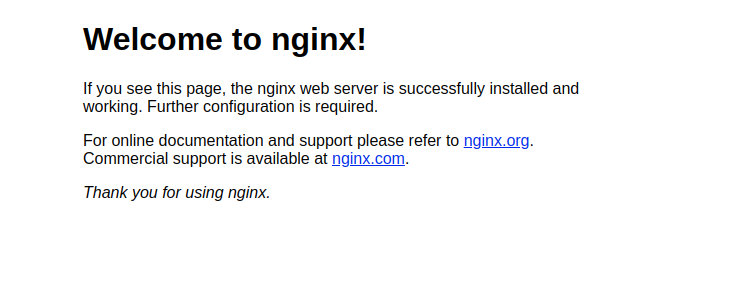
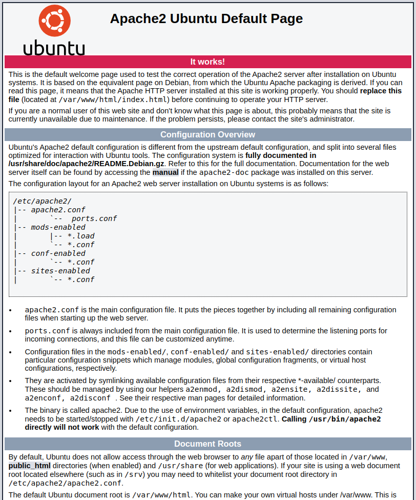

# Tip này sẽ hướng dẫn các bạn cách để start một website thuần html/css/js bằng webserver nginx

Trong thực tế sinh viên thì dường như khi các bạn mới làm quen với web thì có 2 cách để có thể thử nghiệm một trang web trên local bằng cách run file .html bằng trình duyện như chrome, firefox,...

Còn khi các bạn code trên IDE có thể sử dụng extension như liveserver.

> Nhưng khi các ban đưa sản phẩm mà các bạn code ra được lên host thì làm cách nào để nó hoạt động, không thẻ đi kiếm browser trên đó hay IDE extension.

## Cách 1: Dùng webserver `Nginx`

Trước tiên, các bạn cần phải update latest package from apt repos để đảm bảo nhá.

```
$ sudo apt update && sudo apt upgrade
```

Sau đó các bạn cài git và vim cho mình nha, 2 cái này để mình lấy project với sửa file trực tiếp trên host thông qua bash thôi.

```
$ sudo apt install vim git
```

Sau đó, các bạn cài giùm mình webserver Nginx nha.

```
$ sudo apt install nginx
```

Mọi thứ xuông sẻ ha, giờ thì mình cần check xem nginx có hoạt động như mong muốn không ha.

```
$ service nginx status
```

Với câu lệnh này sẽ kiểm tra tình trạng hoạt động của nginx, nếu nó down thì hãy bận nó lên, running thì quá tốt

```
$ service nginx start
```

> Có thể có trường hơp lỗi là ban không bật được nginx mặt dù đã cài, đó là có thằng khác đang giữ port 80 máy của bạn (hold port 80).

Giờ thì mình check xem chúng ta có gì ha


Mọi thứ hoàn hảo (perfect), giờ đến lúc mình đưa dự án mình vào ha, mình sẽ tạo project bên trong thư mục `/var/www`

```
$ cd /var/www
```

Clone project from git

```
$ git clone https://github.com/btxuyenHCMUS/btxuyenhcmus.github.io.git
```

Tada, bạn đã có một project html/css/js hoàn hảo, và giờ config để có thể run được nó thôi.

> Sau khi clone về sẽ có thư mục tên là `btxuyenhcmus.github.io` với file `index.html` bên trong.

Dùng `vim` để mở file config của `nginx` lên.

```
$ vim /etc/nginx/sites-enabled/default
```

và sử dòng root lại từ `/var/www/html` thành `/var/www/btxuyenhcmus.github.io`

!Done, giờ hãy vào localhost và chiêm ngưỡng thành quả thôi nào.


## Cách 2: Dùng webserver `Apache2`

Chúng ta sẽ bắt đầu từ bước cài đặt apache2 webserver nha, còn những bước trước đó hoàn toàn giống với cách 1

```
$ sudo apt install apache2
```

Sau khi cài xong thì nhớ bật nó lên nha

```
$ service apache2 start
```

Kiểm tra thành quả


Giờ thì mình tiếp tục clone project về

```
$ git clone https://github.com/btxuyenHCMUS/btxuyenhcmus.github.io.git
```

Giờ mình sẽ config apache tương tự như nginx

```
$ vim /etc/apache2/sites-enabled/000-default.conf
```

Sửa DocumentRoot thành `/var/www/btxuyenhcmus.github.io`

Restart apache

```
$ service apache2 restart
```

Và chiêm ngưỡng thành quả
