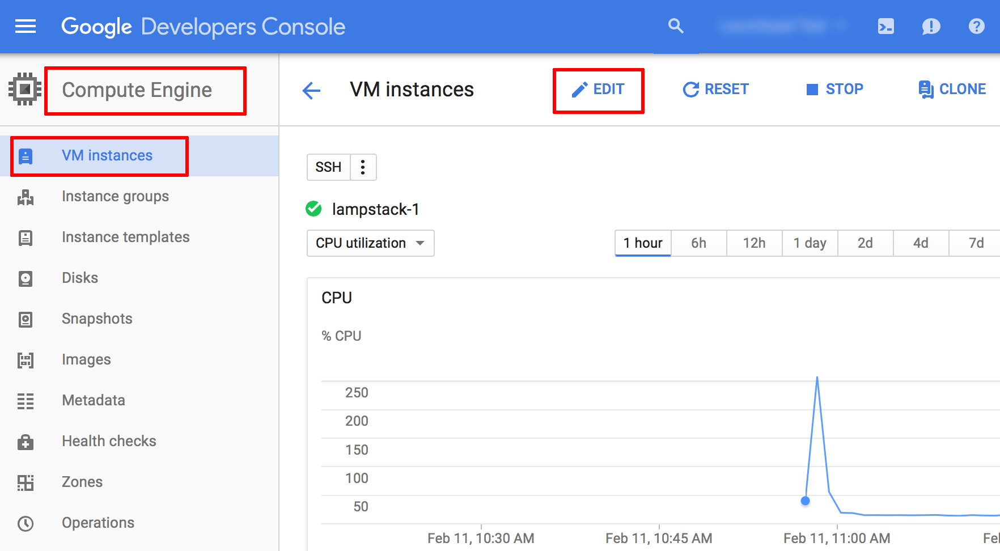
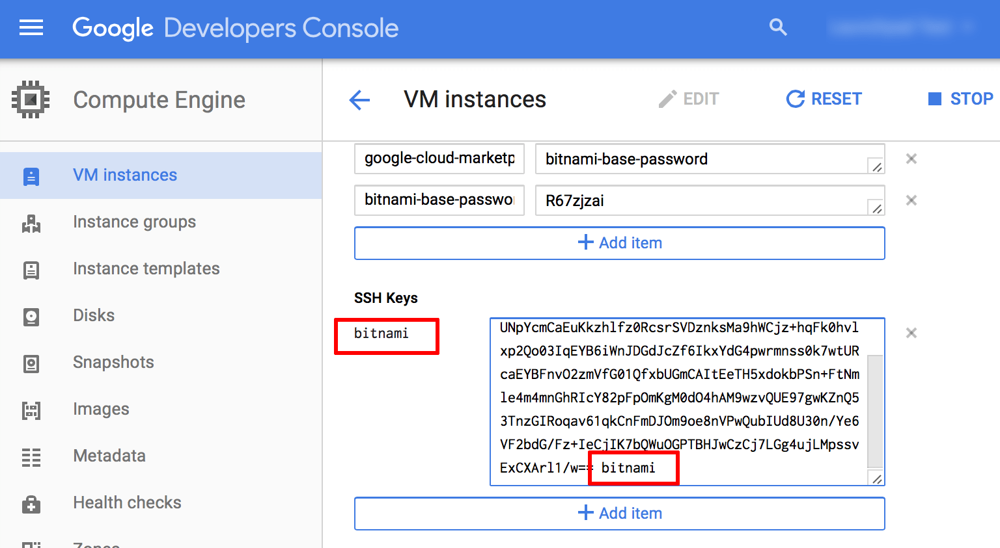
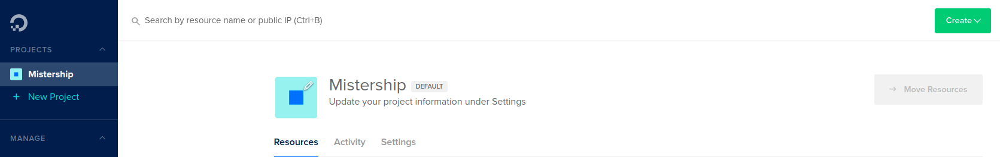

# This tutorial will help you access virtual instance on any server with ssh, server-cli

# First, We are learning with popular server that is **Google**

## Use **ssh** to access instance

1. Follow the steps below in order to add your public SSH key:

- Prepare an SSH key pair for use. To generate a new SSH key pair, you can use PuTTYgen (Window) or the `ssh-keygen` command (linux and macos).

```
$ ssh-keygen
```


You can type name of keygen that you want or default is `id-rsa`.

- Log in to the [Google Cloud Console](https://console.cloud.google.com) and select your project.
- Navigate to the **Compute Engine** -> **VM Instances** page and select the server you wish to connect to.
- Click the **Edit** link in the top control bar.
  
- On the resulting page, copy and paste your public SSH key into the **SSH Keys** field.
- Update the user@hostname comment at the end of the SSH key content to user. This will associate the SSH key with the user account that is already present on the server. The **Username** next to the form field will update accordingly.
  
- Add more keys as needed by clicking the **Add Item** button. Once done, save the changes by clicking the **Save** button.

2. Connect with an ssh client on linux and macos using an ssh key

```
$ ssh user@hostname
```

# Second, We are learning with digital ocean server

## Use **ssh** to access instance

1. Follow the steps below in order to add your public SSH ey:

- Prepare an SSH key pair for use. To generate a new SSH key pair, you can use PuTTYgen (Window) or the `ssh-keygen` command (linux and macos).

```
$ ssh-keygen
```


You can type name of keygen that you want or default is `id-rsa`.

- Log in to the [DigitalOcean](https://cloud.digitalocean.com) and select your project.
  
- Navigate to the **settings** -> **security** page.
- Click the **Add SSH key** in the top right tab _security_.
  
  
