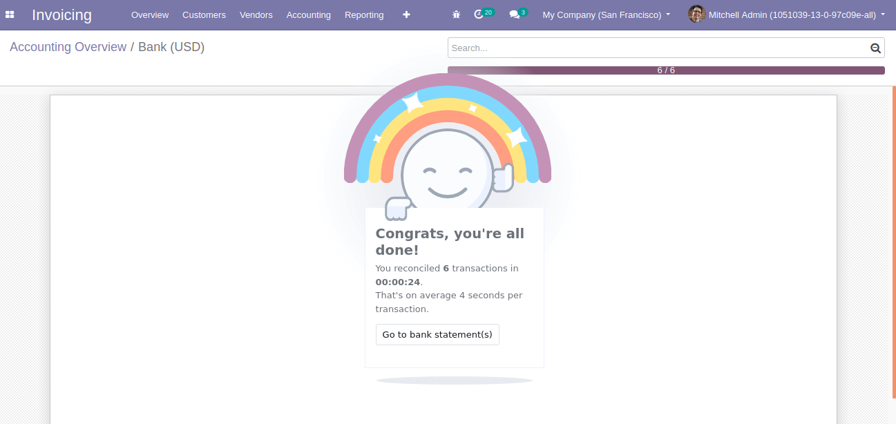
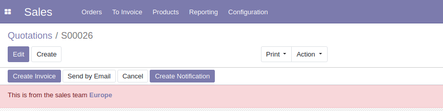

# Một số lưu ý khi phát triễn dự án odoo
1. Khi chỉ cần lấy id của một record thông qua **env** thì nên dùng `_search`
    ```
    # example:
    order_line = self.env['sale.order.line']._search([('name', '=', str)], limit=1)

    # Result:
    This will return for you an integer array [id]
    ```

2. Khi bạn cần lấy một record thông qua **env** thì nên dùng `search` vì khi gọi `search` thì nó sẽ gọi hàm `_search` trước tiên rồi sẽ gọi hàm `browse` để load các record tương ứng với các *id* trả về từ hàm `_search`.
    ```
    # Example:
    order_line = self.env['sale.order.line'].search([('name', '=', str)], limit=1)

    # Result:
    This will return for you an object array [sale.order.line(id, )]
    ```

3. Khi viết các button write state cho các record thì cần lưu ý kiểm tra điều kiện trước khi `write` vì khi có nhiều client cùng lúc tác động nếu không check điều kiện dẫn đến bị `write` nhiều lần.
    ```
    # Example
    # Don't right:
    self.write({
        'state': received,
    })

    # Right:
    self.filtered({lambda rec: rec.state == 'draft'}).write({
        'state': received
    })
    ```
    > Vì khi có nhiều client cùng truy cập một pages, khi client thứ nhất write trạng thái của record nhưng bên client thứ 2 vì còn lưu cache nên button đó không mất đi và vẫn thực hiện được action của button. Code như trên để tránh được việc đó.

4. Khi cần lấy những dòng dữ liệu trong fields **one2many** với điều kiện đơn giản thì thay vì dùng **loop** ta nên dùng *filtered*
    ```
    # Practice with calculating number of line in order have state is done
    count = len(self.order_line_ids.filtered(lambda line: line.state == 'done'))

    # It will return an number that less greater than len(self.order_line_ids)
    ```
    Đế lấy ra danh sách id, hay name hay bất cứ thuộc tính nào ta có thể dùng mapped
    ```
    self.order_line_ids.filtered(lambda line: line.state == 'done').mapped('product_id')
    ```

5. Các thao tác với fields **one2many** đặc biệt:
    - (0, 0, { values }) link to a new record that needs to be created with the given values dictionary
    - (1, ID, { values }) update the linked record with id = ID (write *values* on it)
    - (2, ID) remove and delete the linked record with id = ID (calls unlink on ID, that will delete the object completely, and the link to it as well)
    - (3, ID) cut the link to the linked record with id = ID (delete the relationship between the two objects but does not delete the target object itself)
    - (4, ID) link to existing record with id = ID (adds a relationship)
    - (5) unlink all (like using (3, ID) fr all linked records)
    - (6, 0, [IDs]) replace the list of linked IDs (like using (5) then (4, ID) for each ID in the list of IDs)
    ```
    # Example
    tracking.receipt_line_ids = [(0, 0, {
        'name': name,
        'product_id': product_id.id,
        'state': 'received
    })]
    ```

6. Tạo User cho từng module
    ```
    # Example for location module:
    # Create category inside security folder of location module
    <record id="module_location_category" model="ir.module.category">
        <field name="name">Location</field>
    </record>

    # Create User Group
    <record id="group_location_user" model="ir.groups">
        <field name="name">User</field>
        <field name="category_id" ref="module_location_category"/>
        <field name="implied_ids" eval="[(4, ref('base.group_user'))]"/>
    </record>

    # Create Manager Group
    <record id="group_location_manager" model="ir.groups">
        <field name="name">Manager</field>
        <field name="category_id" ref="module_location_category"/>
        <field name="implied_ids" eval="[(4, ref('group_location_user'))]"/>
        <field name="users" eval=[(4, ref('base.user_root')),
                                (4, ref('base.user_admin'))]/>
    </record>
    ```
    > Define header of csv
    **id,name,model_id:id,group_id:id,perm_read,perm_write,perm_create,perm_unlink**

7. dict vals in *create* and *write*
    Nếu muốn xét xem field nào đó có giá trị được cung cấp hay không ta cần kiểm tra đầu vào có nó hay không trước khi thực hiện **TODO**
    ```
    # Example
    def write(self, vals):
        if not vals.get('lat') and not vals.get('long'):
            return super(Location, self).write(vals)
    ```
    Nghĩa là nếu như khi một location được update nhưng không có thông tin update của tọa độ lat long thì không thực hiện những thao tác tiếp theo với tọa độ.
    **Note:**
        - Hàm super create sẽ trả về  True/False nếu việc tạo dữ liệu thành công/không thành công. Hàm super write sẽ trả về record sau khi đã update.
        - Khi thực hiện việc update thông tin của dữ liệu nếu chỉ update một field đơn lẻ thì có thể dùng `write` hay việc gán bình thường. *Nhưng* khi thay đổi thông tin của nhiều field cùng một lúc thì nên dùng `write` vì khi dùng phép gán nhiều lần thì nó sẽ gọi hàm write nhiều lần.

8. **googlemap**
    ```
    import googlemaps

    def get_google_map_key_api(self):
        return self.env['ir.config_parameter'].sudo().get_param('google.api_key_geocode')

    def get_distance_from_google(self, start, end):
        api_key = self.get_google_map_key_api()

        gmaps = googlemaps.Client(key=api_key)

        origins = (start['lat'], start['long']) if type(start) is dict else (start.lat, state.long)
        destinations = (end['lat'], end['long']) if type(end) is dict else (end.lat, end.long)

        try:
            result = gmaps.distance_matrix(origins=origins, destinations=destinations)
        except Exception as e:
            # TODO
    ```

9. Sự khác biệt giữa `=`, `like`, `ilike`, `=like`, `=ilike`
    - **=**: 2 chuỗi hoàn toàn giống nhau.
    - **like**: chuỗi bên trái nằm bên trong chuỗi bên phải *có* phân biệt hoa thường.
    - **=like**: chuỗi bên trái bằng chuỗi bên phải *có* phân biệt hoa thường.
    - **ilike**: chuỗi bên trái nằm bên trong chuỗi bên phải *không* phân biệt hoa thường.
    - **=ilike**: chuỗi bên trái bằng chuỗi bên phải *không* phân biệt hoa thường.

10. Doing with **context**:
    - get context with current woking `self.env.context.get('fields', False)` - Nghĩa là nó sẽ lấy giá trị của fields, nêu không có thì sẽ trả về *False*.
    - Thực hiện một action với context chỉ định `self.env.ref('module.actions).with_context({'fields': value}).action(self)`.
    - Gán biến context `ctx = dict(self._context) or {}`, nghĩa là lấy ra thông tin về context nếu không có thì trả về một dictionary rỗng.

11. Lấy đơn vị tiền tệ cho từng company
    ```
    def _get_currency(self, cr, uid, context=None):
        user_obj = self.pool.get('res.users')
        currency_obj = self.pool.get('res.currency')
        user = user_obj.browse(cr, uid, uid, context=context)

        if user.company_id:
            return user.company_id.currency_id.id
        else:
            return currency_obj.search(cr, uid, [('rate', '=', 1.0)])[0]
    ```

12. Để check điều kiện ràng buộc các field trong module như ngày thàng bắt đầu nhỏ hơn ngày tháng kết thúc, nên dùng `constraint()` thay cho `onchange()` để bắt sự kiện.

13. Kế thừa một view và muốn thay đổi gì đó ở bản gốc thì chũng ta nên dùng `xpath`, với position như `after, before, replace, attributes`.

14. Differece between **models.Model** and **models.TransientModel**:
    - `models.Model` dùng cho các model chính và sẽ được lưu trong database mãi mãi đến khi có thao tác xóa dữ liệu trong database.
    - `models.TransientModel` dùng cho các model tạm thời (Temporary) như tạo cái *wizard* và nó chỉ được lưu trong một thời gian quy định.

15. Thao tác với dữ liệu
    - `self.env.cr.excute(sql)`

16. **Thao tác với cron**
    ```
    <record id="availability_create_cron" model="ir.cron">
        <field name="name">Task DeadLine Reminder</field>
        <field name="model_id" ref="project.model_project_task"/>
        <field name="state">code</field>
        <field name="code">model._cron_deadline_reminder()</field>
        <field name="user_id" ref="base.user_root" />
        <field name="interval_number">1</field>
        <field name="interval_type">days</field>
        <field name="numbercall">-1</field>
        <field eval="False" name="doall" />
    </record>
    ```

17. **Define __mainifest__ stardard**
    ```
    {
        'name': "Task Deadline Reminder",
        'version': "12.0.1.0.0",
        'author': 'Cybrosys Techno Solutions',
        'company': 'Cybrosys Techno Solutions',
        'website': 'https://www.cybrosys.com',
        'summary': '''Automatically Send Mail To Responsible User if Deadline Of Task is Today''',
        'description': '''Automatically Send Mail To Responsible User if Deadline Of Task is Today''',
        'category': "Project",
        'depends': ['project'],
        'license': 'AGPL-3',
        'data': [
                'views/deadline_reminder_view.xml',
                'views/deadline_reminder_cron.xml',
                'data/deadline_reminder_action_data.xml'
                ],
        'demo': [],
        'images': ['static/description/banner.jpg'],
        'installable': True,
        'auto_install': False
    }
    ```
    
18. **Create configuration for custom module** display in General Setting
    ```
    class CustomModule(models.Model):
        _name = 'custom.module'

        name = fields.Char(required=True)
        seats = fields.Integer(string="Number of seats")
    ```
    The field *seats* will get default value confiurable in the configuration that we will create.
    Configuration model **res_config_settings.py**
    ```
    class ResConfigSettings(models.TransientModel):
        _inherit = 'res.config.settings'

        default_seats = fields.Interger(default_model='custom.module')
        my_setting = fields.Char(string="My Setting")

        def get_values(self):
            res = super(ResConfigSettings, self).get_values()
            res.update(
                my_setting = self.env['ir.config_parameter'].sudo().get_param('custom.my_setting')
            )
            return res
        
        def set_values(self):
            super(ResConfigSettings, self).set_values()
            self.env['ir.config_parameter'].sudo().set_param('custom.my_setting', self.my_setting)
    ```
    Fields with the prefix `default_` will be handle automatically by Odoo to provide default values for fields in some models. (Nhưng field với tiền tố là `prefix_` sẽ được quản lý tự động bởi Odoo mặt định giá trị cho field ở model tương ứng được khai báo)

    Finally there is the view for this model. It is quite a lot code, to match the same style of the other Odoo config pages.
    ```
    <?xml version="1.0" encoding="UTF-8"?>
    <odoo>
        <record id="custom_setting_view" model="ir.ui.view">
            <field name="name">Custom Configuration</field>
            <field name="model">res.config.settings</field>
            <field name="inherit_id" ref="base.res_config_settings_view_form"/>
            <field name="arch" type="xml">
                <xpath expr="//div[hasclass('settings')] position="inside">
                    <div class="app_settings_block" data-string="Custom Data-String" string="Custom" data-key="Custom">
                        <h2>Custom Settings</h2>
                        <div class="row mt16 o_settings_container">
                            <div class="col-xs-12 col-md-6 o_setting_box">
                                <div class="o_setting_right_pane">
                                    <label for="my_setting"/>
                                    <div class="text-muted">
                                        Description text 1
                                    </div>
                                    <div class="content-group">
                                        <div class="mt16">
                                            <field name="my_setting" class="o_light_label"/>
                                        </div>
                                    </div>
                                </div>
                            </div>
                            <div class="col-xs-12 col-md-6 o_setting_box">
                                <div class="o_setting_right_pane">
                                    <label for="default_seats"/>
                                    <div class="text-muted">
                                        Description text 2
                                    </div>
                                    <div class="content-group">
                                        <div class="mt16">
                                            <field name="default_seats" class="o_light_label"/>
                                        </div>
                                    </div>
                                </div>
                            </div>
                        </div>
                    </div>
                </xpath>
            </feild>
        </record>
    </odoo>
    ```
    With the code above, you can access custom configuration in setting menu, To can navigate custom confiuration from custom menu, following code below:
    ```
    <record id="custom_settings_action" model="ir.actions.act_window">
        <field name="name">Custom Configuration</field>
        <field name="res_model">res.config.settings</field>
        <field name="view_id" ref="custom_setting_view"/>
        <field name="view_mode">form</field>
        <field name="target">inline</field>
        <field name="context">{'module': 'custom'}</field>
    </record>

    <menuitem id="custom_settings_menu" name="Configuration" parent="custom_menu" action="custom_settings_actions"/>
    ```
19. So sánh số thực
    ```
    from odoo.tools.float_utils import float_compare

    float_compare(input_val, check_val, pricision) <= 0 or > 0
    ```
20. Nhúng model sử dụng **delegation inheritance**

    Delegation inheritance cho phép chúng ta tái sử dụng lại cấu trúc data mà không cần phải nhân bản data đó. *Ví dụ:* mỗi thành viên thư viện đều có thông tin thẻ thư viện, địa chỉ, email và số điện thoại. Mà địa chỉ, email và số điện thoại là cấu trúc của model `res.partner` chúng ta tạo lại sẽ dẫn đến `duplicate` data, nhưng chúng ta cũng không thể dùng tính năng kế thừa được, vì khi kế thừa res.partner sẽ bị ảnh hưởng bởi library member và khi thằng khác sử dụng thì nó dư thừa logic.
    > Chú ý rằng, cách đặt _name khách với parent model cũng không hợp lý trong trường hợp này, vì dùng differane value from parent model thì nó sẽ tạo một bảng mới cà copy toàn bộ data cũng như feature -> không hợp lý.

    Solution: using Delegation inheritance
    ```
    from odoo import fields, models


    class Member(models.Model):
        _name = 'library.member'
        _description = 'Library Member'
        card_number = fields.Char()
        partner_id = fields.Many2one(
                    'res.partner',
                    delegate=True,
                    ondelete='cascade',
                    required=True)
    ```
    Như vậy model `library.member` sẽ có các fields của res.partner mà không cần duplicate data vì nhưng thông tin đó được liên kết qua fields partner_id.
    > Và khi chúng ta tạo mới một member thì tương ứng một partner cũng được tạo ra và linked với member đó.
    > Option ondelete='cascade` để khi member record bị xóa thì partner linked cũng sẽ được remove thông tin.
    Link [odoo](https://www.odoo.com/documentation/12.0/reference/orm.html#inheritance-and-extension)
21. Tất cả các reference trong sách Odoo 12 Development Esentials - 4th
    - The Building a Module tutorial: [https://www.odoo.com/documentation/12.0/howtos/backend.html](https://www.odoo.com/documentation/12.0/howtos/backend.html)
    - The Odoo Guidelines provide a list of code conventions and guidelines for module development: [https://www.odoo.com/documentation/12.0/reference/guidelines.html](https://www.odoo.com/documentation/12.0/reference/guidelines.html)
    - The Odoo Community Association Guidelines provide a good resource for Odoo development best practices: [https://github.com/OCA/maintainer-tools/blob/master/CONTRIBUTING.md](https://github.com/OCA/maintainer-tools/blob/master/CONTRIBUTING.md)
    - Model inheritance: [https://www.odoo.com/documentation/12.0/reference/orm.html#inheritance-and-extension](https://www.odoo.com/documentation/12.0/reference/orm.html#inheritance-and-extension)
    - View inheritance: [https://www.odoo.com/documentation/12.0/reference/views.html#inheritance](https://www.odoo.com/documentation/12.0/reference/views.html#inheritance)
    - Web Controllers: [https://www.odoo.com/documentation/12.0/reference/http.html#controllers](https://www.odoo.com/documentation/12.0/reference/http.html#controllers)
    - The Odoo official documentation provides additional resources on data files: [https://www.odoo.com/documentation/12.0/reference/data.html#](https://www.odoo.com/documentation/12.0/reference/data.html#)

22. **Model attributes**
    - `_name` là internal identifier. Là thuộc tính bắt buộc khi tạo mới model.
    - `_description` được hiển thị trong model detail trên giao diện. Nó là tùy chọn nhưng được khuyến khích nêu như bạn không muốn xuất hiện vài dòng `warning` trong `log` của bạn.
    - `_order` dùng để sắp xếp record khi được `browsed` hay hiện trên list view. Nó là một chuỗi được dùng trong SQL `order by clouse`, do đó chúng ta có thể làm bất cứ điều gì hợp lý như các hành vi thông minh hơn, hay là một field many-to-one.
    - `_rec_name` chỉ định ra field dùng để mô tả khi nó được tham chiếu ở field related, ví dụ như quan hệ many-to-one. Mặc định, sẽ dùng field `name`.
    - `_table` là tên của bảng trong database. Thông thường, nó được tự động tạo ra bở ORM với quy ước là tên của model với dấu chấm chuyển thành dấu gạch dưới-underscores.
    - `_log_access=False` có thể chỉ định để chặn việc tự động tạo ra các field tracking: `create_uid, create_date, write_uid, và write_date`.
    - `_auto=False` có thể dùng chỉ định chặn việc tự động tạo bảng trong database. Nếu cần thiết, `init()` nên được viết lại.
    - `inherit`
    - `inherits`

23. **Model Type**
    - `models.Model` model dài hạn. Bảng trong database được tạo và và lưu trữ cho đến khi có hành động xóa.
    - `models.TransientModel` được dùng trong `wizard`. Dữ liệu chỉ tồn tại trong một thời gian chỉ định.
    - `models.AbstractModel` không có data được lưu trữ. Chúng được dùng để tái sử dụng tính năng.

24. **Many2many** field

    Ở cấp độ database, mỗi quan hệ nhiều nhiều không tạo ra bất cứ cột nào, thay vào đó nó sẽ tự tạo ra một bản lưu trữ lại mỗi quan hệ giữa các record. Một bảng đặt biệt chỉ có 2 fields ID.

    Mặt định, bảng sẽ có tên được gọp lại 2 bảng với dấu dạch dưới và kết thúc bằng `_rel`.

    Trong một số trường hợp, nếu tên 2 model quá dài dẫn đến bảng rel sẽ vượt ngưỡng 63 kí tự (giới hạn của Postgresql), trong trường hơp này mình nên chỉ định lại tên của bản `rel`.

    Một trường hơp khác là khi cần tạo nhiều quan hệ với cùng một model. Chúng ta cần cung chấp tên cho từng bảng.

    ```
    # Book <-> Authors relation (using keyword args)
    author_ids = fields.Many2many(
        comodel_name='res.partner', # related model (required)
        relation='library_book_res_partner_rel', # relation table name
        column1='a_id', # rel table field for "this" record
        column2='p_id', # rel table field for "other" record
        string='Authors') # string label text
    ```

24. **compute** agrs

    Tham số compute vào được truyền dạng chuỗi (trong dấu ngoặc nháy kép/đơn) khi hàm compute được viết trước hoặc sau khi khai báo thuộc tính.

    Tham số compute được truyền dưới dạng tên hàm chỉ khi hàm compute được viết trước khi khai báo field. Ngược lại sẽ báo lỗi.

25. **SQL model constraints**

    SQL contraints are added to the database table definition and are enforced directly by PostgreSQL. The are defined using the `_sql_constraints` class attribute.

    *It is a list of tuples, and each tuple has the format `(name, code, error)`*:
    - **name** is the constraint identifier name
    - **code** is the PostgreSQL syntax for the constraint
    - **error** is the error message to present to users when the constraint is not verified

26. **Accessing date and time values**

    Odoo also provides a few additional convenience functions in the odoo.tools.date_utils module. These functions are as follows:
    - `start_of(value, granularity)` thời gian bắt đầu của đơn vị chỉ định (granularity) -- year , quarter , month , week , day , or hour .
    - `end_of(value, granularity)` thời gian kết thúc của đơn vị chỉ định như trên.
    - 

27. **Notification**
    - Sticky Notification
        ```
        return {
            'effect': {
                'fadeout': 'slow',
                'message': 'Enter your custom message here',
                'type': 'rainbow_man',
            }
        }
        ```
        
    - Alerts
        ```
        <xpath expr="//sheet" position="before">
            <div class="alert alert-danger" role="alert" style="margin-bottom: 0px;" attrs="{'invisible': [('state', '!=', 'sale')]}">
            This is from the sales team
                <bold>
                    <a class="alert-link" role="button">
                        <field name="team_id" readonly="True"/>
                    </a>
                </bold>
            </div>
        </xpath>
        ```
        
28. Controller nhận body request không cần qua tham số `params`:
    ```
    data = json.loads(request.httprequest.data.decode('utf-8'))
    ```
29. Xử lý lỗi trắng màng hình sau khi login khi vừa mới restore một data mới.
    Vào trong postgresql thực hiện câu lệnh sau:
    ```
    DELETE FROM ir_attachment WHERE datas_fname SIMILAR TO '%.(js|css)'
    ```
30. Search nhiều fields vào cùng một biến trên `search` view.
    ```
    <field name="name" string="Information" filter_domain="['|','|', '|', '|', '|',('name','ilike',self),('customer_fullname','ilike',self),('customer_tel','ilike',self), ('source','ilike',self), ('shipping_customer_fixed','ilike',self),('shipping_phone_fixed','ilike',self)]"/>
    ```
31. Chỉ định search view cho từng actions.
    ```
    <field name="search_view_id" ref="vn_shipping_order_search_view"/>
    ```
32.  Disable form view in one2many xml
    ```
    odoo.define('your_module.views', function(require) {
        "use strict";

        var List = require('web.ListRenderer');
        List.include({
            _onRowClicked: function(e) {
                if (!this.el.classList.contains('tree_no_open')) {
                    this._super.apply(this, arguments);
                }
            }
        });
    });
    ```
    and set attribute for tree with `class="tree_no_open"`
    > Note: declare js code in xml with inherit web.assets_backend.
    ```
    <?xml version="1.0" encoding="utf-8"?>
    <odoo>
        <data>
            <template id="assets_backend" inherit_id="web.assets_backend">
                <xpath expr="." position="inside">
                    <script type="text/javascript" src="/felixbuy_module/static/src/js/views.js"></script>
                </xpath>
            </template>
        </data>
    </odoo>
    ```
33. Change `title` on all pages.
    ```
    odoo.define('felixbuy_module.WebClient', function(require) {
        "use strict";
        var AbstractWebClient = require('web.AbstractWebClient');
        AbstractWebClient = AbstractWebClient.include({
            start: function(parent) {
                this.set('title_part', { "zopenerp": "Buyngon" });
                this._super(parent);
            },
        });
    });
    ```
    > Note: declare js code in xml with inherit web.assets_backend.
34. Very Important! Không được dùng `channels` để triển khai tính năng notify, bởi vì cơ chế longpolling sẽ làm shutdown đột ngột `database`.

35. Get location id from json list name and id
    ```
    def _get_location_from_usg(self, address):
        """
        This is func load data from static file and 
        return tuple (province_id, district_id, ward_id)
        """
        def _lstrip_all(address):
            return "".join(address.split())
        items = address.split(',')
        province, district = _lstrip_all(items[-1]), _lstrip_all(items[-2])
        ward, street = _lstrip_all(items[-3]), "".join(items[0: -3])
        current_path = os.path.dirname(os.path.realpath(__file__))
        with open(
            current_path + '/../../static/location/usg-location.json') \
                as json_file:
            data = json.load(json_file)
            address_dicts = list(filter(lambda self: ward.lower() in _lstrip_all(
                self.get('ward_name', '')).lower(), data))
            if len(address_dicts) > 1:
                address_dicts = list(filter(lambda self: district.lower() in _lstrip_all(
                    self.get('district_name', '')).lower(), address_dicts))
            if len(address_dicts) > 1:
                list(filter(lambda self: province.lower() in _lstrip_all(
                    self.get('province_name', '')).lower(), address_dicts))
            return address_dicts[0]
    ```

36. Using `requests` to call open api from another partner.
    ```
    try:
        requests.post(url=url, headers=headers, data=json.dumps(data), timeout=4)
    except requests.exceptions.Timeout as e:
        print(e)
    except:
        print("Cannot call api!")
    ```

37. Odoo XML-RPC chỉ cho phép truyền số nguyên 32-bit, do đó để truyền ra bên ngoài ta cần convert số nguyên sang chuỗi.
    ```
    def parse_number2string(number):
        """Convert Interger 32-bit to String"""
        if not isinstance(number, str):
            number = str(number)
        return number
    ```
