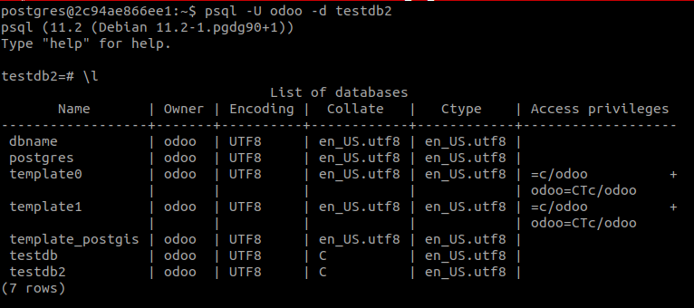
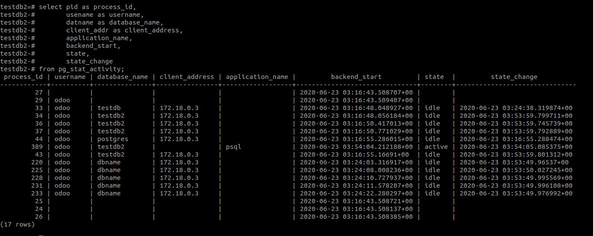

# Các tính năng cần thiết khi sử dụng postgresql (daemon not GUI)

## Dump database

Postgresql cung cấp công cộng `pg_dump` một cách đơn giản để backing từng database. Command phải được chạy dưới quyền có thể đọc database đó, trong ví dụ lần này là thao tác với database của **Odoo** nên có user postgres nhưng **owner** của các database là **odoo** (do thiết lập ban đầu).

1. Đăng nhập vào `postgres` user:
   ```
   $ su - postgres
   ```
2. Truy cập vào `psql`:

   ```
   $ psql -U odoo -d testdb2
   ```

   - **-U odoo**: Sử dụng qyền của odoo.
   - **-d testdb2**: Truy cập vào database.

   Xem tất cả các database có trong cơ sở dữ liệu của chúng ta

   ```
   testdb2=# \l
   ```

   

   Tạo user postgres cho tương thích với user trên máy

   ```
   testdb2=# CREATE USER postgres;
   ```

   Cấp quyền truy cập cho user vừa tạo, (Postgresql - How to grant access to users), ở đây sẽ cho nó quyền của supperuser

   ```
   testdb2=# ALTER USER postgres WITH SUPERUSER;
   ```

3. Như vậy là đã xong với thao tác với psql, thoát khỏi `psql` và ở user `postgres`:
   ```
   pg_dump testdb2 > restoredb.dump
   ```
   Và như vậy là mình đã có một file được dump ra từ database

## Restore dump database

1. Trước tiên ta phải tạo một database mà mình muốn restore file dump vào:
   ```
   testdb2=# CREATE DATABASE restoredb WITH OWNER=odoo;
   ```
   Trong quá trình tạo có thể bị sai và việc xóa dẫn đến thông báo rằng có một sesions khác đang dùng database nên không xóa được, để xác định thằng nào đang dùng, mình sẽ list danh sách các session và database đang sử dụng.
   ```
   testdb2=# select pid as process_id,
               usename as username,
               datname as database_name,
               client_addr as client_address,
               application_name,
               backend_start,
               state,
               state_change
           from pg_stat_activity;
   ```
   
2. Sau khi đã tạo được database, sẽ là bước restore
   ```
   $ psql restoredb < restoredb.dump
   ```

!!Done

# Setup `master/slave` for postgresql using docker

1.  Let’s setup a PostgreSQL database

    - Bước đầu tiên các bạn phải tạo cho mình một con `postgresql` trên server `master`.

    - Tùy theo lại image postgres mà mình sẽ có cách viết `docker-compose` khác nhau.

    - Chung quy lại những thứ cần thiết là `environment` và `volumes` để khi down up không bị mất dữ liệu.

2.  Sau khi up đươc postgres lên, chúng ta phải đi tìm kiếm 2 file config quan trọng củ postgres đó là `postgresql.conf` và `pg_hba.conf`.

    - Access vào bên trong postgresql container.
    - Login vào postgres bằng `psql`
      ```
      psql -U <user> -d <db_name>
      ```
    - Lấy đường dẫn của `postgresql.conf`
      ```
      name# SHOW config_file;
      ```
    - Lấy đường dẫn của `pg_hba.conf`
      ```
      name# SHOW hba_file;
      ```
    - Copy 2 file trong container ra ngoài môi trường thật.

3.  Let’s setup a PostgreSQL master database !

    - Chỉnh sửa file `postgresql.conf`
      ```
      wal_level = replica
      hot_standby = on
      max_wal_senders = 10
      max_replication_slots = 10
      hot_standby_feedback = on
      ```
    - Chỉnh sửa file `pg_hba.conf`
      ```
      ...
      host    replication     replicator      0.0.0.0/0            trust
      ...
      ```
    - Down postgres container và chỉnh sửa để mount 2 file conf vào bên trong.
    - Up lại container (nhớ open port)

4.  Let’s Get Ready For Slave !

    - Create the replicator user on master
      ```
      CREATE USER replicator WITH REPLICATION ENCRYPTED PASSWORD 'my_replicator_password';
      ```
    - Create the physical replication slot on master
      ```
      SELECT * FROM pg_create_physical_replication_slot('replication_slot_slave1');
      ```
    - Check
      ```
      SELECT * FROM pg_replication_slots;
      ```
      and you see
      ```
      -[ RECORD 1 ]-------+------------------------
      slot_name           | replication_slot_slave1
      plugin              |
      slot_type           | physical
      datoid              |
      database            |
      temporary           | f
      active              | f
      active_pid          |
      xmin                |
      catalog_xmin        |
      restart_lsn         |
      confirmed_flush_lsn |
      ```

5.  We need to get a backup from our master database and restore it for the slave. The best way for doing this is to usepg_basebackup command.

    ```
    pg_basebackup -D /tmp/postgresslave -S replication_slot_slave1 -X stream -P -U replicator -Fp -R
    ```

    After that, cp folder from inside container to outside of real environment

6.  Copy data folder backup and 2 file conf to another server to make a slave.

7.  Tạo docker-compose cho slave tương tự như master. - Đặt biệc trước khi up nó lên. chúng ta cần phải chỉnh sửa lại một vài chi tiết sau. - Vì data lần này được backup nên nó sẽ phát sinh file recovery.conf chúng ta cẩn phải tinh chỉnh nó trước khi up slave. - \*
    `primary_conninfo = 'host=127.0.0.1 port=5432 user=replicator password=my_replicator_password' restore_command = 'cp /var/lib/postgresql/data/pg_wal/%f "%p"'` - Sau đó up slave và check ở master
    `SELECT * FROM pg_replication_slots;`
    And you see similar that,
    `-[ RECORD 1 ]-------+----------------------------- slot_name | replication_slot_slave1 plugin | slot_type | physical datoid | database | temporary | f active | t active_pid | 1332 xmin | 20800 catalog_xmin | restart_lsn | 0/105AB6F8 confirmed_flush_lsn | wal_status | reserved safe_wal_size |`
    !!Done
