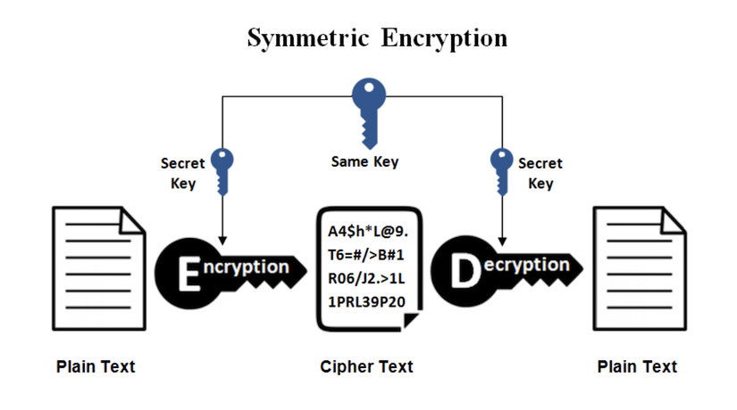
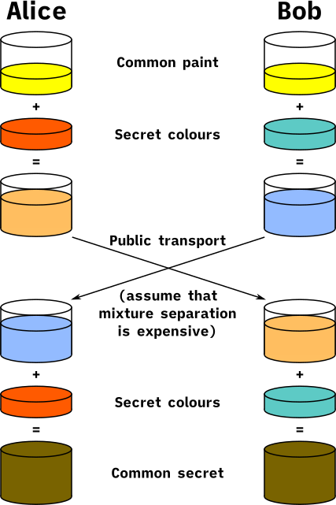
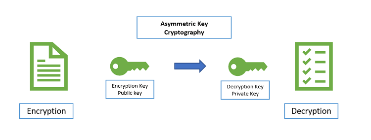

# How to generate a ssh key
```
$ ssh-keygen -t rsa
```
# How to copy publish ssh key from local to server google
```
add ssh key in edit instance
```
## Method 2
```
$ ssh-copy-id -i ~/.ssh/id_rsa.pub username@ip-host
```
## Method 3: manual
patse publish key to file `authorized_keys` in server
```
$ ~/.ssh/authorized_keys
```

# How to setup authorized_keys for any user
```
$ mkdir ~/.ssh
$ chmod 700 ~/.ssh
$ vim ~/.ssh/authorized_keys
    # patse your ssh key to file
$ chomod 600 ~/.ssh/authorized_keys
```
If you are permission denied, you can't edit config in `/etc/ssh/ssh_config` and restart `ssh` service

# **Original Workflow of SSH (Secure Shell)**
## SSH hoạt động như thế nào?
Hay cụ thể hơn, SSH làm thế nào để **đảm bảo dữ liệu truyền qua lại giữa 2 bên được mã hóa sao cho chỉ 1 trong 2 bên mới giải mã được?**

Để làm được điều này, SSH sử dụng 2 kĩ thuật chính:
- **Symmetric encryption**
- **Asymetric encryption**
### **Symmetric encryption** Mã hóa đối xứng


Để mã hóa và giải mã dữ liệu, sẽ cần đến những chiếc key. Trong mã hóa đối xứng, cả 2 bên sẽ sử dụng chung một key duy nhất, vừa để mã hóa và vừa để giải mã dữ liệu. Key này được gọi là `secret key`.
> mỗi phiên SSH sẽ có một secret key riêng, và secret key này sẽ được cả 2 bên cùng tạo ra trước khi kết nối được thiết lập.

Thuật toán để tạo ra key này gọi là `Key Exchange Algorithm`, hay tên đầy đủ hơn là `Diffie Hellman Key Exchange`.

Cái hay đầu tiên là mặc dù thuật toán tên là Key Exchange (trao đổi key), nhưng thực tế lại không có một cái key nào được đem ra trao đổi cả. Điều này nghĩa là secret key sẽ không bao giờ được gửi qua gửi lại giữa 2 bên (vì gửi như vậy hacker có thể chặn bắt và lấy được key).

Thay vào đó, 2 bên sẽ thông qua một số bước để tự tạo ra được key giống nhau. Không chỉ thế, key này còn là (gần như) độc nhất, và không một bên thứ 3 nào có thể tạo ra được.

Example:



- A: xyz + hhu = xyzhhu,xyzgth + hhu = xyzgthhhu
- B: xyz + gth = xyzgth,xyzhhu + gth = xyzhhugth

Như chúng ta vừa tìm hiểu, dù 2 bên không trực tiếp gửi secret key cho nhau, nhưng vẫn gửi qua lại những chuỗi byte ngẫu nhiên. Sẽ tốt hơn nếu những chuỗi byte này cũng được mã hóa, và đúng là chúng sẽ được mã hóa. Kĩ thuật dùng để mã hóa các chuỗi byte này gọi là Asymmetric Encryption - Hay mã hóa bất đối xứng.

### **Asymmetric Encryption**


Cụ thể, mỗi bên sẽ chuẩn bị cho mình 2 chiếc key: `public key` và `private key`. `Public key` là công khai, ai biết cũng được, nhưng `private key` phải được giấu đi, không cho ai biết hết. Dữ liệu sẽ được mã hóa bằng `public key`, và chỉ có thể được giải mã bằng `private key`.

Vậy các chuỗi byte ngẫu nhiên mà mình vừa nói sẽ được mã hóa và giải mã như thế nào?

Giả sử là bạn muốn SSH vào một server đi.
- Đầu mỗi phiên SSH, cả phía bạn và server đều tự tạo ra một cặp public - private key, và gửi public key của mình cho đối phương.
- Khi này, server sẽ dùng public key mà bạn gửi để mã hóa chuỗi byte và gửi cho bạn. Vì chỉ mình bạn có private key, nên chỉ mình bạn mới giải mã được chuỗi byte này.
- Tương tự, bạn cũng mã hóa chuỗi byte của mình bằng public key nhận được từ server. Chỉ server mới có private key để giải mã.

Do kĩ thuật mã hóa public - private key này tốn tài nguyên hơn, nên nó **chỉ được dùng ở giai đoạn đầu để tạo ra secret key**. Đến khi tạo ra được secret key rồi thì cả 2 bên sẽ dùng secret key để vừa mã hóa, vừa giải mã dữ liệu.

Một phần quan trọng không thể thiếu nữa của SSH chính là xác thực người dùng (client authentication). Nếu không có bước xác thực này thì ai cũng có thể SSH vào server của bạn, hay clone project từ github của bạn mất.

Nói đơn giản thì khi sử dụng phương pháp này để xác thực với server, bạn sẽ tạo sẵn một cặp public - private key. Sau đó, bạn gửi public key của mình qua cho server. Server sẽ lưu public key này lại (thường là trong một file tên là **authorized_keys**.

Mỗi khi bắt đầu một phiên SSH, bạn sẽ gửi cho server public key của mình. Nếu server thấy public key này đã có mặt trong authorized_keys, thì server sẽ thực hiện thêm 1 số bước nữa để đảm bảo bạn có cả private key. **Sau khi xác nhận rằng bạn có cả private lẫn public key, việc xác thực coi như hoàn tất**.